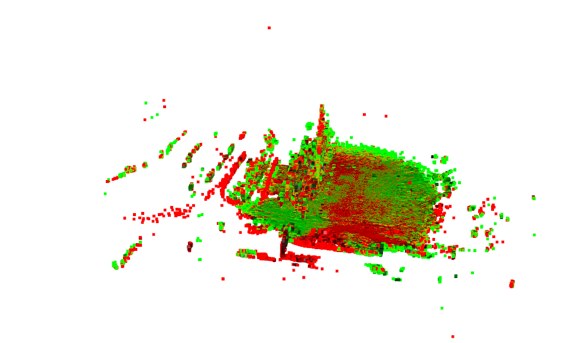
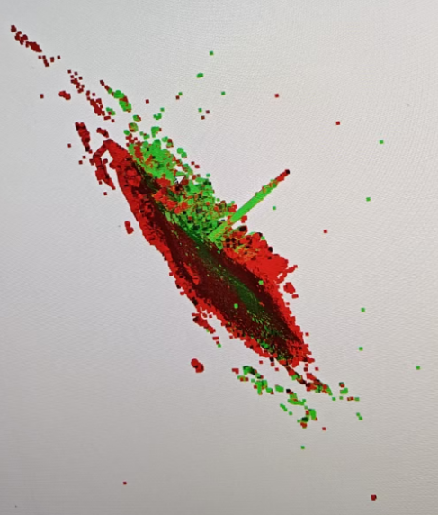
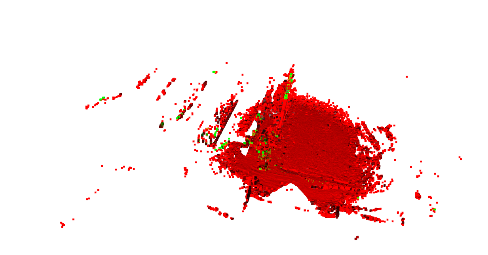
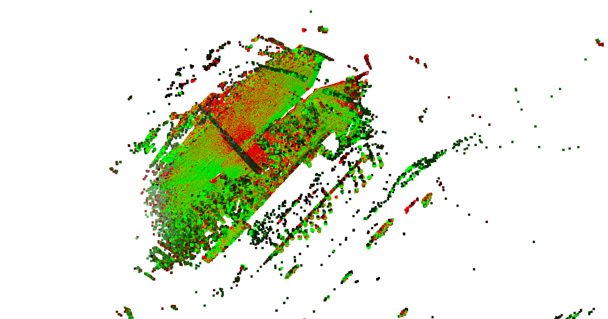
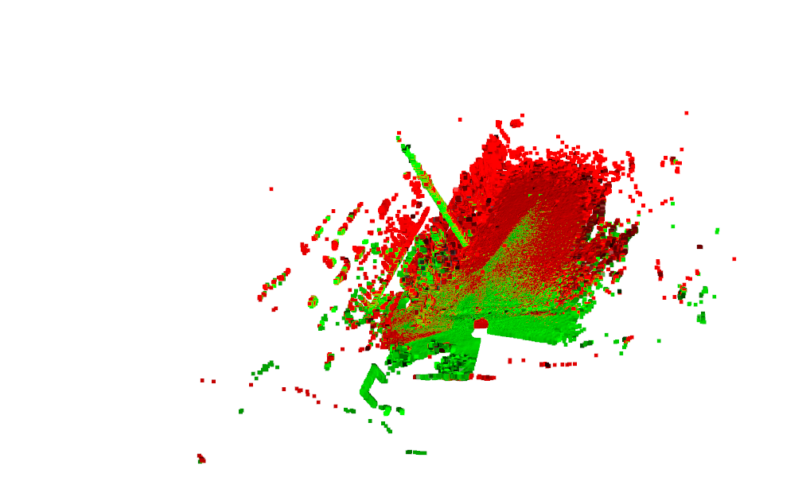
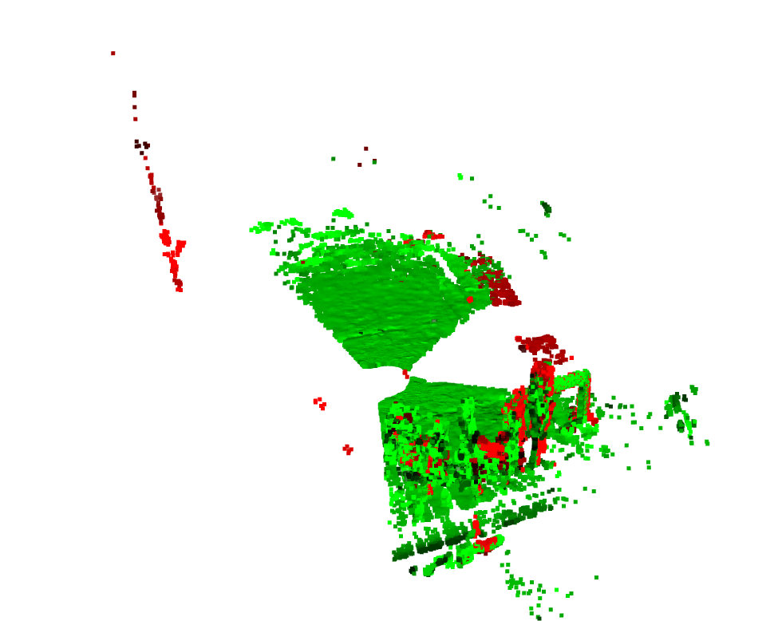
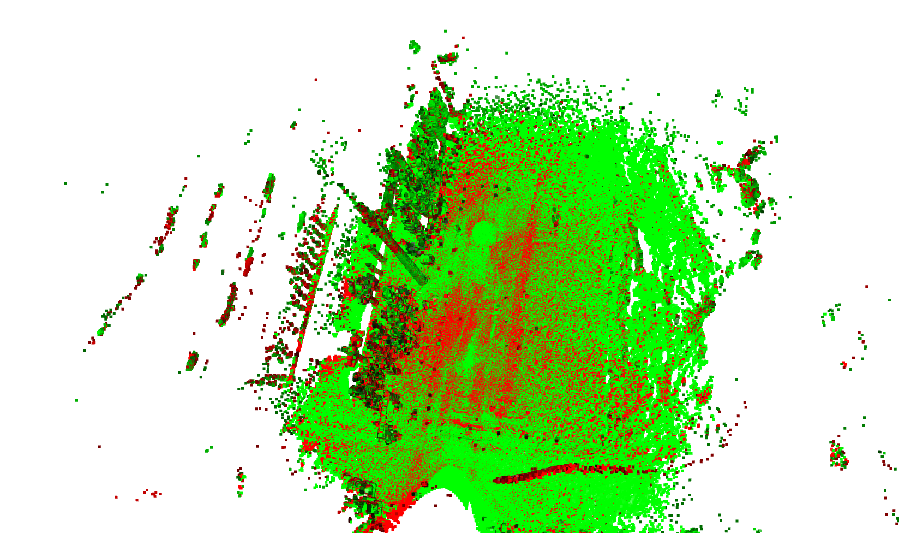

# ICP: A method for registration of 3-D shapes
一个普通的ICP算法，但是由于我的设备时jetson agx orin Ubuntu22.04版本，CPU远远弱于GPU，所以将ICP算法做了GPU加速
要实现GPU加速就要去自己编译C++库,但是编译一堆问题，所以用回CPU吧
## voxel参数
简单来说，voxel_size主要有三大作用：
同时对两个点云进行降低采样
voxel_size（体素大小）是一个极其关键的核心参数。它不仅仅是一个简单的数值，而是定义了整个配准流程工作尺度（Scale）的基准。
1. 控制点云的密度（体素下采样）
这是 voxel_size 最直接的功能。代码中的 pcd.voxel_down_sample(voxel_size)会执行以下操作：
   它会在你的点云空间中创建一个三维网格，每个小立方体（就是“体素”，Voxel）的边长就是你设定的 voxel_size。
   然后，它会把落入同一个小立方体内的所有点，用这些点的平均值（质心）来代替。
   效果：原始点云可能有几百万甚至上千万个点，非常密集。经过下采样后，点云数量会大幅减少，同时保留了物体的基本形状。

为什么这么做？
   提速：后续的特征计算和匹配过程在点数减少后会快几个数量级。
   消除冗余：原始点云中很多点是冗余的，下采样可以去除这些冗余，让点云分布更均匀。

如何选择？
   voxel_size越大，下采样后剩下的点越少，处理越快，但丢失的细节也越多。
   voxel_size越小，保留的细节越多，但计算也越慢。

2. 定义特征计算的邻域范围
voxel_size被用来推导计算法线和FPFH特征时的搜索半径：
①	为了计算某一个点的法线方向，算法需要看它周围的邻近点。这个半径定义了“邻近”是多大范围。
②	计算FPFH特征: radius=voxel_size*5
③	FPFH特征描述了一个点的局部几何形状。同样，这个半径定义了“局部”是多大范围。

这个半径非常重要，因为它决定了算法的“视野”。一个合适的半径能让算法捕捉到有意义的几何结构（比如墙角、边缘），从而生成有区分度的特征，为后续的正确匹配打下基础。

3. 设定匹配过程中的距离阈值
voxel_size还被用来设定后续配准步骤中的距离阈值：
在全局配准 (RANSAC): distance_threshold = voxel_size * 1.5`
在RANSAC寻找最佳初始变换时，它会认为两对特征点如果距离小于这个阈值，才可能是一对正确的匹配。
精配准 (ICP): distance_threshold = voxel_size * 0.4
在ICP迭代过程中，它只考虑源点云和目标点云中距离小于这个阈值的点对。这可以有效排除错误的、距离很远的点对的干扰。

总结
`voxel_size` 是整个流程的“纲”，它纲举目张地影响了**点云密度、特征尺度、匹配容差**这三个核心环节。你可以把它理解为算法处理点云的“分辨率”。

## 运行
```
python demo.py "C:\Abandon\PCD_Data\data\data_2_cut.pcd" "C:\Abandon\PCD_Data\data\data_2_cut_transformed.pcd" --skip-crop
第一个参数是source点云，第二个参数是target点云

--voxel             "表示降采样的程度，值越大，点越少"
--crop-expand
--no-global         "跳过FPFH+RANSAC，使用质心对齐作为初始变换"
--skip-crop         "目标已是裁剪子集，跳过裁剪"
--use-gpu           "使用 GPU 版本的 ICP 进行精配准,还在开发中" 
```

## 检验是否能够使用Cuda，即是否能够使用GPU资源加速计算
```
python testCuda.py
```

# 有可能需要知道mid360到底是以什么为单位的
基于AI生成的答案
对于几乎所有来自真实世界激光雷达（LiDAR）的 SLAM 算法（如 Fast-LIO, LOAM, LeGO-LOAM 等），它们在 ROS (Robot Operating System) 框架下处理和输出的点云，**默认的单位都是米 (meters)**。
这是 ROS 系统中一个广泛遵守的约定（REP-103: Standard Units of Measure and Coordinate Conventions），以确保不同传感器和算法之间的数据可以无缝交互。
所以，你可以非常确定：
**你的点云数据单位是米 (m)。**
因此，你计算出的平均点间距 `0.021681` 的单位就是**米**，约等于 2.17 厘米。
这个尺度对于 Livox Mid-360 这样的激光雷达在室内或近距离室外环境扫描是完全合理的。

## 计算点云中点之间的平均距离（解决精度问题）
```
python computePoint.py "C:\Abandon\PCD_Data\1117pcd\5m-30mlaihui.pcd"
```
### 结果
```    
成功加载点云: C:\Abandon\PCD_Data\1117pcd\5m-30mlaihui.pcd
========================================
点云的平均点间距是: 0.021681
========================================
建议:
这是一个很好的 `voxel_size` 的初始参考值。
你可以从 voxel_size = 0.0217 开始尝试，
或者设为它的几倍，例如 0.1084 或 0.2168，
然后根据配准效果和速度进行调整。
```

## 检验结果
```
python verify.py # 将你的矩阵答案放到verify.py中作为T变量
```
## 落地实验
### 高度5m数据使用demo.py运行结果
#### 使用命令对两个5m数据进行配准
```
python demo.py "C:\Abandon\PCD_Data\1117pcd\5m-30mlaihui.pcd" "C:\Abandon\PCD_Data\1117pcd\5m-30mlaihui1.pcd" --voxel 0.2 --skip-crop
```
#### 输出结果
```
cropped target count: 4471400
running global registration (FPFH + RANSAC)...
global init_trans:
 [[ 0.99961904  0.0090918  -0.02605973 -0.48376225]
 [-0.00934477  0.99991023 -0.00960204  0.2612823 ]
 [ 0.02597009  0.00984191  0.99961427  0.47834226]
 [ 0.          0.          0.          1.        ]]
global fitness: 0.8734565421186554 inlier_rmse: 0.14968548670326018
refining with ICP...
ICP fitness: 0.9598622333839888 rmse: 0.02697540228113096
final transformation:
 [[ 0.99956341  0.01876094 -0.0228257  -0.52530404]
 [-0.01898117  0.99977499 -0.00947021  0.2384029 ]
 [ 0.02264289  0.00989933  0.9996946   0.38887255]
 [ 0.          0.          0.          1.        ]]
[Open3D WARNING] [ViewControl] SetViewPoint() failed because window height and width are not set.
```



#### 使用命令对大点云dixingcaiji和小点云（5m高度）进行一个配准
```
python demo.py "C:\Abandon\PCD_Data\1117pcd\5m-30mlaihui.pcd" "C:\Abandon\PCD_Data\1117pcd\dixingcaiji.pcd" --voxel 0.2 --skip-crop
```
#### 生成结果
```
cropped target count: 2965139
running global registration (FPFH + RANSAC)...
global init_trans:
 [[ 9.98177321e-01 -9.06007962e-04  6.03424794e-02  6.11457520e-01]
 [ 6.70832246e-04  9.99992102e-01  3.91749351e-03  6.21167739e-01]
 [-6.03455520e-02 -3.86987349e-03  9.98170045e-01  5.32165849e-01]
 [ 0.00000000e+00  0.00000000e+00  0.00000000e+00  1.00000000e+00]]
global fitness: 0.5234498459890183 inlier_rmse: 0.16664087937800262
refining with ICP...
ICP fitness: 0.7448728629212589 rmse: 0.034259410459597704
final transformation:
 [[ 0.99777648  0.01194947  0.06556902  0.56657819]
 [-0.01303002  0.99978586  0.01607673  0.41341183]
 [-0.06536287 -0.01689535  0.99771852  0.49001161]
 [ 0.          0.          0.          1.        ]]
```
 

### 高度2m使用demo.py运行结果

#### 使用命令（这里面2m-30mlaihui1这个数据是大数据，而目标这个是小数据，要使用大去对小，这样子才能得出图中的结果，小去对大可能很容易进入局部最优导致匹配错误）
```
python demo.py "C:\Abandon\PCD_Data\1117pcd\2m-30mlaihui1.pcd" "C:\Abandon\PCD_Data\1117pcd\2m-30mlaihui.pcd" --voxel 0.2 --skip-crop
```
```
cropped target count: 18627
running global registration (FPFH + RANSAC)...
[Open3D WARNING] Too few correspondences (2173) after mutual filter, fall back to original correspondences.
global init_trans:
 [[1. 0. 0. 0.]
 [0. 1. 0. 0.]
 [0. 0. 1. 0.]
 [0. 0. 0. 1.]]
global fitness: 0.0 inlier_rmse: 0.0
refining with ICP...
ICP fitness: 0.026563110658869012 rmse: 0.05070781715875687
final transformation:
 [[ 0.99993692  0.01042934  0.00416868  0.02097781]
 [-0.01043878  0.99994299  0.00224812 -0.1399351 ]
 [-0.004145   -0.0022915   0.99998878 -0.06008712]
 [ 0.          0.          0.          1.        ]]
[Open3D WARNING] [ViewControl] SetViewPoint() failed because window height and width are not set.
```




### 使用另一个命令（对laihui4和laihui5进行配准）

```
python demo.py "C:\Abandon\PCD_Data\1117pcd\2m-30mlaihui4.pcd" "C:\Abandon\PCD_Data\1117pcd\2m-30mlaihui5.pcd" --voxel 0.2 --skip-crop
```
```
cropped target count: 2261440
running global registration (FPFH + RANSAC)...
global init_trans:
 [[ 9.98092250e-01  1.71724397e-03  6.17163864e-02  6.23584085e-01]
 [-8.56272671e-04  9.99901990e-01 -1.39741906e-02  1.73153576e-01]
 [-6.17343347e-02  1.38946852e-02  9.97995897e-01  3.04776908e-01]
 [ 0.00000000e+00  0.00000000e+00  0.00000000e+00  1.00000000e+00]]
global fitness: 0.9786753838164605 inlier_rmse: 0.10936708418408482
refining with ICP...
ICP fitness: 0.9298794350327009 rmse: 0.034395540273941316
final transformation:
 [[ 0.99820709  0.00180221  0.05982765  0.70982265]
 [-0.00106636  0.99992343 -0.01232908  0.13832282]
 [-0.05984529  0.01224317  0.99813258  0.30797013]
 [ 0.          0.          0.          1.        ]]
[Open3D WARNING] [ViewControl] SetViewPoint() failed because window height and width are not set.
```



### 使用另一个命令（对2mlaihui1和2mlaihui进行一个配准）

```
python demo.py "C:\Abandon\PCD_Data\1117pcd\2mlaihui1.pcd" "C:\Abandon\PCD_Data\1117pcd\2mlaihui.pcd" --voxel 0.3 --skip-crop
```
```
cropped target count: 2231927
running global registration (FPFH + RANSAC)...
global init_trans:
 [[ 9.74359426e-01 -1.25499652e-02 -2.24646852e-01 -5.33347921e+00]
 [ 1.10866813e-02  9.99908321e-01 -7.77398929e-03  1.81078970e+00]
 [ 2.24723820e-01  5.08407169e-03  9.74409235e-01  6.28701414e-01]
 [ 0.00000000e+00  0.00000000e+00  0.00000000e+00  1.00000000e+00]]
global fitness: 0.5947928339615502 inlier_rmse: 0.20905190573242274
refining with ICP...
ICP fitness: 0.6068053846456831 rmse: 0.04127966828045808
final transformation:
 [[ 0.9751606  -0.01685235 -0.22085697 -5.47795198]
 [ 0.01231549  0.99968424 -0.02190306  2.03630022]
 [ 0.22115635  0.01863904  0.97506023  0.80849428]
 [ 0.          0.          0.          1.        ]]

```


warning 问题很大，可能是因为RANSAC的偏差导致的，如果我们把两个输入对调可能导致问题，可以尝试加大降采样，修改ransac或者其他方式

错误解
```
python demo.py "C:\Abandon\PCD_Data\1117pcd\2mlaihui.pcd" "C:\Abandon\PCD_Data\1117pcd\2mlaihui1.pcd" --voxel 0.1 --skip-crop
PS C:\Abandon\Code\Python\ICP> python demo.py "C:\Abandon\PCD_Data\1117pcd\2mlaihui.pcd" "C:\Abandon\PCD_Data\1117pcd\2mlaihui1.pcd" --voxel 0.1 --skip-crop
cropped target count: 2310347
running global registration (FPFH + RANSAC)...
global init_trans:
 [[1. 0. 0. 0.]
 [0. 1. 0. 0.]
 [0. 0. 1. 0.]
 [0. 0. 0. 1.]]
global fitness: 0.0 inlier_rmse: 0.0
refining with ICP...
ICP fitness: 0.0007383754038550544 rmse: 0.029804554825176396
final transformation:
 [[ 0.99948467  0.02999615  0.01142883 -0.255581  ]
 [-0.0301125   0.999495    0.01014832 -0.7019945 ]
 [-0.01111865 -0.01048724  0.99988319 -0.26612117]
 [ 0.          0.          0.          1.        ]]

```
#### 现在可能又没有问题了


#### 对2mqujiang和2mqiluo进行一个配准
```
python demo.py "C:\Abandon\PCD_Data\1117pcd\2mqujiang.pcd" "C:\Abandon\PCD_Data\1117pcd\2mqiluo.pcd" --voxel 0.5
```
```
cropped target count: 130350
running global registration (FPFH + RANSAC)...
global init_trans:
 [[-0.97642246  0.21327125 -0.03338483 -1.02181111]
 [ 0.19525289  0.93850383  0.28475758  1.33240991]
 [ 0.0920624   0.27152521 -0.95801804 20.49912267]
 [ 0.          0.          0.          1.        ]]
global fitness: 0.5379310344827586 inlier_rmse: 0.4341429802890211
refining with ICP...
ICP fitness: 0.6642663043478261 rmse: 0.08987535376589262
final transformation:
 [[-9.95828996e-01  8.97310582e-02 -1.65211187e-02 -2.66405942e+00]
 [ 8.58071787e-02  9.82605217e-01  1.64694007e-01  7.79441539e-01]
 [ 3.10119050e-02  1.62589438e-01 -9.86206336e-01  1.89799409e+01]
 [ 0.00000000e+00  0.00000000e+00  0.00000000e+00  1.00000000e+00]]
```


#### 对2m-30mlaihui1和5m-30mlaihui1进行一个配准(2m和5m之间不存在非刚体变换)
```
python demo.py "C:\Abandon\PCD_Data\1117pcd\2m-30mlaihui1.pcd" "C:\Abandon\PCD_Data\1117pcd\5m-30mlaihui1.pcd" --voxel 0.3 --skip-crop
```
```                                           
cropped target count: 4471400
running global registration (FPFH + RANSAC)...
global init_trans:
 [[ 0.99781289 -0.01136706 -0.06511697  0.83714632]
 [ 0.0131186   0.99956182  0.02653436  0.31852459]
 [ 0.06478682 -0.02733057  0.99752479  0.31015154]
 [ 0.          0.          0.          1.        ]]
global fitness: 0.9823126520986477 inlier_rmse: 0.157140193856258
refining with ICP...
ICP fitness: 0.9879963171218624 rmse: 0.029808478372007414
final transformation:
 [[ 0.99778984 -0.01140394 -0.06546289  0.79541045]
 [ 0.01334926  0.99947987  0.02935637  0.18184143]
 [ 0.06509406 -0.03016537  0.99742309  0.31319559]
 [ 0.          0.          0.          1.        ]]
```
